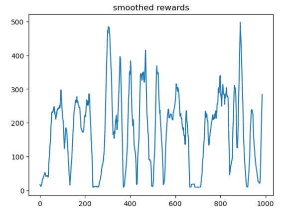
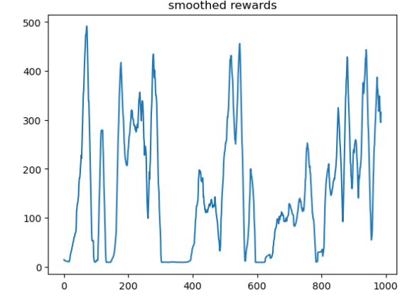
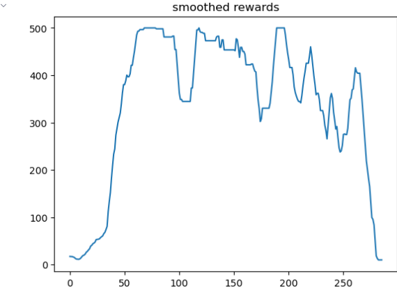

# Exploring Reinforcement Learning: DQN, DDQN, and N-step DQN Algorithms

**Author:** Panagiotis Konstantinos Kakkavas

**Date:** December 2023

## Abstract

This report explores Reinforcement Learning (RL), focusing on Deep Q-Networks (DQN), Double DQN (DDQN), and N-step DQN algorithms. It aims to provide a comprehensive understanding of their mechanisms, implementations, and applications in the field of machine learning.

## Introduction to Reinforcement Learning

Reinforcement Learning is a subset of machine learning where an agent learns to make decisions through trial and error interactions with an environment, aiming to maximize cumulative rewards.

The algorithms implemented in this project are off-policy, meaning that the decision-making process during training (e-greedy) and during evaluation (maximum Q value) differ.

### Key Concepts

- **Agent**: The learner or decision-maker.
- **Environment**: The system with which the agent interacts.
- **Action**: Decisions made by the agent.
- **State**: The current situation or context in the environment.
- **Reward**: Feedback from the environment in response to the agent's actions.

## The Bellman Equation

The Bellman Equation is central to many RL algorithms, providing a recursive relationship for calculating the value of a state or a state-action pair.

### State-Value Function

The value of a state under a policy π:
`V^π(s) = E_π [ Σ_{k=0}^{∞} γ^k R_{t+k+1} | S_t = s ]`

### Action-Value Function (Q-function)

The value of taking an action a in state s under policy π:
`Q^π(s, a) = E_π [ Σ_{k=0}^{∞} γ^k R_{t+k+1} | S_t = s, A_t = a ]`

### Bellman Expectation Equation

For the action-value function:
`Q^π(s, a) = E [ R_{t+1} + γ Q^π(S_{t+1}, A_{t+1}) | S_t = s, A_t = a ]`

## Deep Q-Network (DQN)

DQN integrates deep learning with Q-learning, using a neural network to approximate the Q-function. [Human-level control through deep reinforcement learning. Nature, 518(7540), 529-533.](https://arxiv.org/abs/1312.5602)

### Network Architecture

- **Input**: State representation.
- **Hidden Layers**: Feature extraction layers (often convolutional for image inputs).
- **Output**: Q-values for each action.

### Learning Process

To train efficiently, we use the **Experience Replay Buffer** storing transitions to break the correlation between learning steps and to create batches. Replay Buffer types are either a simple array from which you simply sample or a more complex data structure that uses priority to sample experiences that will have a high impact on the learning process due to high Temporal Difference error.

The probability of sampling transition i is given by:
`P(i) = p_i^a / Σ_k p_k^a`
and p_i > 0 is the priority of transition i. The exponent α determines how much prioritization is used, with α = 0 corresponding to the uniform case.

### Loss Function

The loss function for DQN:
`L(θ) = E [ ( R_{t+1} + γ max_{a'} Q(S_{t+1}, a'; θ) - Q(S_t, A_t; θ) )^2 ]`
where θ are the parameters of the main network

## Double Deep Q-Network (DDQN)

DDQN addresses the overestimation bias of DQN by decoupling action selection and evaluation. [Deep Reinforcement Learning with Double Q-learning. AAAI Conference on Artificial Intelligence.](https://arxiv.org/abs/1509.06461)

### Modification in DDQN

In DDQN, the action selection is done by the main network, while the evaluation is done by the target network.

## N-step DQN

N-step DQN considers a sequence of n steps for updates, extending temporal-difference learning and leading to faster learning. [Reinforcement Learning: An Introduction (2nd ed.). MIT Press.](http://incompleteideas.net/book/the-book-2nd.html)

### N-step Return

The N-step return:
`R_t^{(n)} = Σ_{k=0}^{n-1} γ^k R_{t+k+1}`
`Q(S_t, A_t) ← Q(S_t, A_t) + α ( R_t^{(n)} + γ^n max_{a'} Q(S_{t+n}, a') - Q(S_t, A_t) )`

## Conclusion

This report presents an analysis and implementation in python with PyTorch and open-ai-gymnasium of DQN, DDQN, and N-step DQN algorithms in reinforcement learning, highlighting their advancements and applications in a simple CartPole environment.

The experimental results were as follows:

*DQN Results*

*DDQN Results*

*N-step DQN Results*

The N-step Q learning algorithms surpassed the performance of the single-step DQN and DDQN algorithms. However, more efficient algorithms can be implemented and combined with n-step to provide better results, like Prioritized Experience Replay, Dueling network architecture, noisy nets, distributional Q-learning, and many more.

You can find the code analytically implemented and commented in my GitHub repository:
[RL-SemesterProject](https://github.com/ElGreKost/RL-SemesterProject.git)
